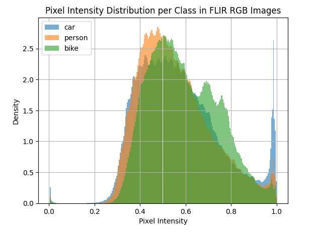
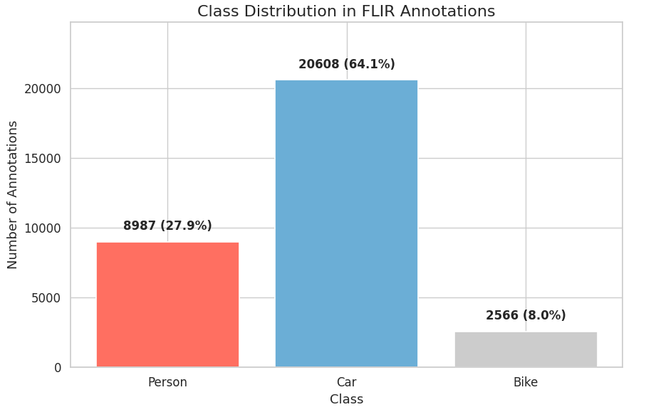

# Feature Fusion and Knowledge-Distilled Multi-Modal Multi-Target Detection
**Ngoc Tuyen Do and Tri Nhu Do**

- [tuyen.dn242305m@sis.hust.edu.vn](https://scholar.google.com/citations?hl=en&user=o8w6IZ4AAAAJ)
- [tri-nhu.do@polymtl.ca](https://scholar.google.com/citations?hl=en&user=cwdP-oYAAAAJ)

## Abstract
In the surveillance and defense domain, multi-target detection and classification (MTD) is considered essential yet challenging due to heterogeneous inputs from diverse data sources and the computational complexity of algorithms designed for resource-constrained embedded devices, particularly for AI-based solutions. To address these challenges, we propose a feature fusion and knowledge-distilled framework for multi-modal MTD that leverages data fusion to enhance accuracy and employs knowledge distillation for improved domain adaptation. Specifically, our approach utilizes both RGB and thermal image inputs within a novel fusion-based multi-modal model, coupled with a distillation training pipeline. We formulate the problem as a posterior probability optimization task, which is solved through a multi-stage training pipeline supported by a composite loss function. This loss function effectively transfers knowledge from a teacher model to a student model. Experimental results demonstrate that our student model achieves approximately 95% of the teacher model’s mean Average Precision while reducing inference time by approximately 50%, underscoring its suitability for practical MTD deployment scenarios.
### Keywords: *Mutli-target detection, knowledge distillation, feature fusion, optimization, AI/ML, FLIR, thermal data, RGB*

## Paper
- [PDF on GitHub](./manuscript_v1.pdf)

## Project Structure

```css
Feature-Fusion-Knowledge-Distilled-Multi-Modal-Multi-Target-Detection/
├── README.md               /* Project description, usage guide, and examples */
├── requirements.txt        /* List of required Python packages */
├── dataset/                /* Folder containing input data */
│   └── FLIR_ALIGNED        /* Preprocessed or aligned dataset */
├── models/                 /* Model architecture and fusion methods */
│   ├── model.py            /* Main model definition */
│   ├── loss.py             /* Loss function definitions */
│   ├── fusion.py           /* Feature fusion modules */
│   └── bench.py            /* Benchmarking or inference utilities */
├── utils/                  /* Utility functions (e.g., metrics, visualization) */
│   └──                     /* Utilization files */
└── dataloader/             /* Data loading logic for training/inference */
│   └──                     
├── train_branch.py         /* Train single branch model */
├── train_fusion.txt        /* Train fusion model */
├── train_student.md        /* Train student model */
├── val_fusion.py           /* Evaluation file */
├── plot_hist.py            /* Plot histogram for dataset */
```

## Run Locally

### Clone the project

```bash
  git clone https://github.com/tnd-lab/Feature-Fusion-Knowledge-Distilled-Multi-Modal-Multi-Target-Detection.git
  cd Feature-Fusion-Knowledge-Distilled-Multi-Modal-Multi-Target-Detection
```

### Set up environment

```bash
  # create virtual environment
  python3 -m venv .env
  # active venv
  source .env/bin/activate
  # install packages with pip
  pip3 instal -r requirements.txt
```
## Dataset: FLIR Aligned
Download from [my drive](https://drive.google.com/file/d/1i6iWs2OUVbbKEUOEnORfBJpoI525Guwy/view?usp=sharing)
Unzip and put it in folder dataset
```bash
  unzip FLIR_Aligned.zip
  cd /path/to/project/
  mkdir dataset
  cp /path/to/dataset/FLIR_Aligned /path/to/project/dataset/FLIR_Aligned
```


## Plot Histogram

```bash
  python3 plot_hist.py
```

<p align="center">
  
  
</p>


## Training Pipeline
### 1. Training individual branch with type of image (RGB or thermal) respectively for each type of model (teacher and student)
- file: `train_branch.py`
- change values of *class Arg*
```python
class Args:
    branch = 'rgb' # rgb or thermal
    dataset = 'flir_aligned_rgb' # flir_aligned_rgb or flir_aligned_thermal
    model_type = 'student' # teacher or student
    prefetcher = True # for use gpu or not
    wandb = True # to save image of evaluation phase
```
- run script
```bash
  python3 train_branch.py
```
- checkpoint results will be save to example path: `output/{model_type}/{branch}/train_flir/EXP_FLIR_ALIGNED_{BRANCH}_CBAM/model_best.pth`

### 2. Training *fusion model* for each type of model (teacher and student)
- file: `train_fuion.py`
- change values of *class Arg*
```python
class Args:
    branch = 'fusion'
    dataset = 'flir_aligned_full' # flir_aligned_rgb or flir_aligned_thermal
    model_type = 'teacher' # teacher or student
    prefetcher = True # for use gpu or not
    wandb = True # to save image of evaluation phase
    teacher_thermal_checkpoint_path = 'path/to/checkpoint/' # checkpoint path get from step 1
    student_thermal_checkpoint_path = 'path/to/checkpoint/'
    teacher_rgb_checkpoint_path = 'path/to/checkpoint/'
    student_rgb_checkpoint_path = 'path/to/checkpoint/'
```
- run script
```bash
  python3 train_fusion.py
```
- result will be save to example path: `output/{model_type}/fusion/train_flir/EXP_FLIR_ALIGNED_FULL_CBAM/model_best.pth`

### 3. Training *student model*
- file: `train_student.py`
- change values of *class Arg*
```python
class Args:
    branch = 'fusion'
    dataset = 'flir_aligned_full' # flir_aligned_rgb or flir_aligned_thermal
    prefetcher = True # for use gpu or not
    wandb = True # to save image of evaluation phase
    student_thermal_checkpoint_path = 'path/to/checkpoint/' # checkpoint path get from step 1
    student_rgb_checkpoint_path = 'path/to/checkpoint/'
    teacher_checkpoint = 'path/to/checkpoint/'  # checkpoint path get from step 2
```
- run script
```bash
  python3 train_fusion.py
```
- result will be save to example path: `output/student/distilled/train_flir/EXP_FLIR_ALIGNED_FULL_CBAM/model_best.pth`
## Evaluation
### Evaluate trained *student model*
- file: `val_fusion.py`
- change values of *class Arg*
```python
class Args:
    branch = 'fusion'
    dataset = 'flir_aligned_full'
    model_type = 'student' # teacher or student
    prefetcher = True # for use gpu or not
    checkpoint = '/path/to/student/trained/checkpoint/model_best.pth.tar'
```
- run script
```bash
  python3 val_fusion.py
```


## Authors
- [tuyen.dn242305m@sis.hust.edu.vn](https://scholar.google.com/citations?hl=en&user=o8w6IZ4AAAAJ)
- [tri-nhu.do@polymtl.ca](https://scholar.google.com/citations?hl=en&user=cwdP-oYAAAAJ)
